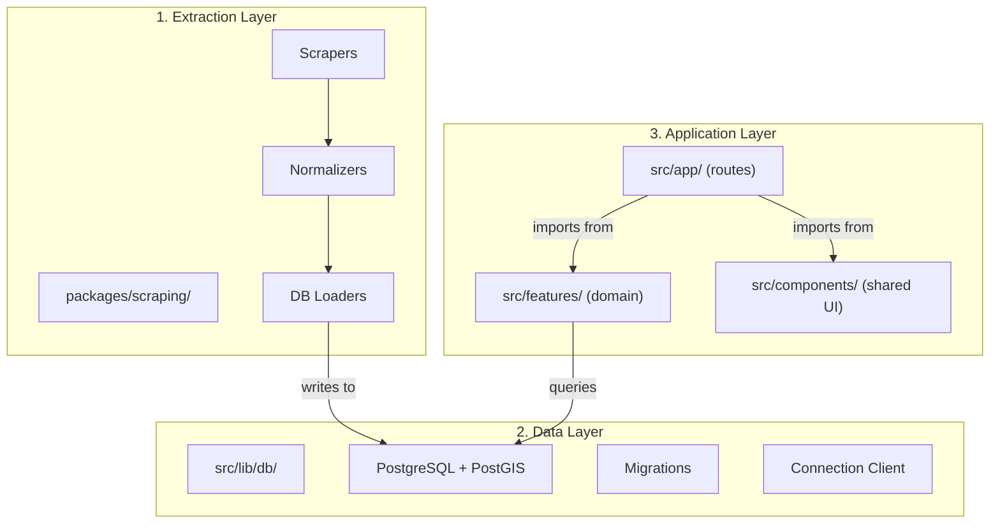

# Architecture of Hogari

## TL;DR

Use **Screaming Architecture** as the organizing philosophy (folders scream the domain: `properties`, `search`, `scraping`, `ai`) with **Clean Architecture principles** applied inside each feature module (use-cases → repositories → infrastructure). Skip the full-blown Clean Arch ceremony — it's overkill for a 4-person team on Next.js.

---

## Why Not Pure Clean Architecture?

Clean Architecture (ports & adapters, hexagonal, onion — same family) enforces strict dependency inversion through interfaces at every boundary. In a TypeScript/Next.js context this means:

- **Interface explosion.** You'd need `PropertyRepository` interface → `PostgresPropertyRepository` implementation → injection container... for every data access point. With 4 people, this ceremony slows you down more than it protects you.
- **Fighting the framework.** Next.js App Router _is_ the controller layer. Server Actions _are_ the use-cases entrypoint. Wrapping them in abstract interfaces to "decouple from the framework" defeats the point — you're **not** going to swap Next.js mid-project.
- **Overkill for your team size.** Clean Arch shines on 15+ person teams where modules need to be independently deployable. With 4 people, direct communication replaces most of what the architecture enforces.

> [!TIP]
> Take the **principles** from Clean Architecture (dependency direction, separation of concerns, domain isolation) without the **ceremony** (full DI containers, abstract factory patterns, hexagonal port definitions).

---

## Why Screaming Architecture Fits

Screaming Architecture (coined by Uncle Bob himself) says: _when you look at the folder structure, it should scream the domain, not the framework._ Your repo should scream **"real estate platform"**, not **"Next.js app"**.

This directly solves your team coordination problem:

| Problem                       | How Screaming Arch Solves It                                                        |
| ----------------------------- | ----------------------------------------------------------------------------------- |
| 4 devs stepping on each other | Each dev owns a **feature domain** folder — minimal merge conflicts                 |
| New dev onboarding            | Open the `src/` folder → immediately understand what the app does                   |
| Scrapers mixed with UI code   | `scraping/` is a completely separate workspace — can't accidentally import UI utils |
| AI logic scattered everywhere | `ai/` module owns all LLM orchestration in one place                                |

---

## Recommended Folder Structure

```
hogari/
├── packages/
│   └── scraping/                    ← EXTRACTION LAYER (independent workspace)
│       ├── package.json
│       ├── README.md
│       ├── main.py                  ← CLI execution entry point
│       ├── scrapers/
│       │   ├── __init__.py
│       │   ├── base.py              ← Base scraper (delays, robots.txt, user-agent)
│       │   └── [webpage_name].py    ← Site-specific scraper (e.g., rentola.py, inm.py)
│       ├── normalizers/
│       │   ├── __init__.py
│       │   └── property_normalizer.py ← Property normalization to database schema
│       └── loaders/
│           ├── __init__.py
│           └── db_loader.py         ← DB loader/UPSERT script using psycopg2
│
├── src/                              ← APPLICATION LAYER (Next.js)
│   ├── app/                          ← Routes only. Thin. Delegates everything.
│   │   ├── layout.tsx
│   │   ├── globals.css
│   │   ├── page.tsx                  ← Landing page (current)
│   │   ├── (marketing)/              ← Route group for landing/waitlist pages
│   │   │   └── ...
│   │   └── (platform)/               ← Route group for the actual app
│   │       ├── search/
│   │       │   ├── page.tsx          ← The split-screen search page
│   │       │   ├── loading.tsx
│   │       │   └── error.tsx
│   │       └── property/
│   │           └── [id]/
│   │               └── page.tsx
│   │
│   ├── features/                     ← DOMAIN MODULES (this screams the business)
│   │   ├── properties/
│   │   │   ├── actions/              ← Server Actions (the "use cases")
│   │   │   │   ├── get-properties.ts
│   │   │   │   ├── get-property-by-id.ts
│   │   │   │   └── search-properties.ts
│   │   │   ├── components/           ← UI specific to this feature
│   │   │   │   ├── PropertyCard.tsx
│   │   │   │   ├── PropertyList.tsx
│   │   │   │   └── PropertyFilters.tsx
│   │   │   ├── types.ts              ← Domain types (Property, PropertyFilter, etc.)
│   │   │   └── queries.ts            ← Raw SQL/PostGIS queries for this domain
│   │   │
│   │   ├── map/
│   │   │   ├── components/
│   │   │   │   ├── MapView.tsx       ← Client component with Mapbox
│   │   │   │   ├── MapMarker.tsx
│   │   │   │   └── MapControls.tsx
│   │   │   └── hooks/
│   │   │       └── use-map-instance.ts
│   │   │
│   │   ├── search/
│   │   │   ├── actions/
│   │   │   │   └── hybrid-search.ts  ← PostGIS filter → AI re-rank pipeline
│   │   │   ├── components/
│   │   │   │   └── SearchBar.tsx
│   │   │   └── types.ts
│   │   │
│   │   └── ai/
│   │       ├── actions/
│   │       │   ├── rank-properties.ts
│   │       │   └── explain-recommendation.ts
│   │       ├── prompts/
│   │       │   └── ranking-prompt.ts
│   │       └── types.ts              ← AI response schemas (Zod)
│   │
│   ├── components/                   ← SHARED UI (layout, design system)
│   │   ├── layout/
│   │   │   ├── NavBar.tsx
│   │   │   ├── Footer.tsx
│   │   │   └── WaveDivider.tsx
│   │   ├── home/                     ← Landing page sections
│   │   │   ├── Hero.tsx
│   │   │   ├── ProblemSection.tsx
│   │   │   └── ...
│   │   └── ui/                       ← Primitives (Button, Input, Card, etc.)
│   │       ├── Button.tsx
│   │       ├── Input.tsx
│   │       └── Card.tsx
│   │
│   └── lib/                          ← INFRASTRUCTURE / SHARED UTILITIES
│       ├── db/
│       │   ├── client.ts             ← Postgres connection (singleton)
│       │   ├── migrations/           ← SQL migration files
│       │   └── seed.ts
│       ├── env.ts                    ← Validated env vars (Zod schema)
│       └── utils.ts                  ← Generic helpers (cn(), formatCurrency(), etc.)
│
├── pnpm-workspace.yaml               ← Declares packages/* as workspace members
├── package.json
└── tsconfig.json
```

---

## The Three Layers Mapped

Your idea.md already defines 3 layers. Here's how they map to the structure:



### Rules of Dependency

| Module               | Can Import From                          | Cannot Import From           |
| -------------------- | ---------------------------------------- | ---------------------------- |
| `src/app/` (routes)  | `features/*`, `components/*`, `lib/*`    | `packages/scraping/`         |
| `src/features/*`     | `lib/*`, other `features/*` (sparingly)  | `app/`, `packages/scraping/` |
| `src/components/`    | `lib/utils`                              | `features/*`, `app/`         |
| `src/lib/`           | Nothing internal                         | Everything else              |
| `packages/scraping/` | Environment variables (via `.env.local`) | Everything in `src/`         |

> [!IMPORTANT]
> **The critical rule:** dependencies flow inward. Routes → Features → Lib. Never the reverse. This is the one Clean Architecture principle you **must** enforce.

---

## Inside a Feature Module

Each feature follows a lightweight internal pattern:

```
features/properties/
├── actions/          ← "Use cases" — Server Actions that orchestrate logic
├── components/       ← UI that belongs ONLY to this feature
├── queries.ts        ← Data access (PostGIS SQL, or ORM calls)
└── types.ts          ← Domain types and Zod schemas
```

**Why this works with Next.js:**

- **Server Actions as use-cases.** `"use server"` functions in `actions/` are your application logic. They validate input (Zod), call `queries.ts`, maybe invoke `ai/actions/`, and return typed results. No need for an abstract "use case" class.
- **queries.ts as repository.** Direct SQL queries with PostGIS. If you later adopt Drizzle or Prisma, you swap this one file per feature. No interface needed — the file boundary _is_ the contract.
- **types.ts as domain model.** Plain TypeScript types + Zod schemas. No classes, no inheritance — this is TypeScript, not Java.

---

## Team Ownership Model

With 4 people, assign **domain ownership**, not layer ownership:

| Person | Primary Domain                              | Secondary            |
| ------ | ------------------------------------------- | -------------------- |
| Dev A  | `features/properties/` + `features/search/` | `lib/db/`            |
| Dev B  | `features/map/`                             | `components/ui/`     |
| Dev C  | `features/ai/` + `features/search/`         | `lib/`               |
| Dev D  | `packages/scraping/`                        | `lib/db/migrations/` |

> [!TIP]
> **Vertical slicing** (each dev owns a full feature from UI to data) produces fewer merge conflicts than horizontal slicing (one person does all UI, another all DB). The scraper dev (Dev D) is naturally isolated in `packages/scraping/`.

### Conventions to Minimize Conflict

1. **Route files are thin.** `page.tsx` should be ~20 lines: import feature components, compose them, done. Nobody fights over routes.
2. **Shared components go through PR review.** Changes to `components/ui/` affect everyone — require at least 1 approval.
3. **Feature modules are independent.** `features/properties/` should never directly import from `features/map/`. If they need to communicate, it happens at the route level (parent passes props) or through a shared type in `lib/`.
4. **One barrel export per feature.** Each feature has a clear public API. Internal files are implementation details.

---

## Scrapers as a Separate Workspace

The `packages/scraping/` workspace is **critical**. It deserves full isolation because:

- **Language & Runtime:** It is written in Python (using `BeautifulSoup`, `requests`, `psycopg2-binary`, and `python-dotenv`), which is better suited for data extraction tasks than Next.js.
- **Execution:** It runs as a CLI command via `pnpm --filter @hogari/scraping scrape --source rentola --city bahia-blanca --limit 2` to fetch, normalize, and load data.
- **Independent Testing:** Integration tests and scrapers run locally or in a dedicated VPS/worker, not in the Next.js Vercel environment.
- **Direct Database Integration:** It writes directly to the Neon PostgreSQL database via a dedicated loader utilizing psycopg2 and raw SQL.

Add it to your `pnpm-workspace.yaml`:

```yaml
packages:
  - "packages/*"
```

---

## What About State Management?

For the split-screen search page (list + map), you'll need shared state. Recommendation:

- **URL as state.** Filters, coordinates, zoom level — all live in URL search params. This gives you free deep-linking, shareable searches, and SSR.
- **React Context** (sparingly) for ephemeral UI state like "hovered property" that needs to sync the list highlight with the map marker.
- **No Redux, no Zustand.** With Server Components doing the heavy data lifting and URL params handling filter state, you don't need a client-side store for this app.

---

## Summary: What You're Actually Using

| Concept                                 | From Clean Arch? | From Screaming Arch? | Custom?             |
| --------------------------------------- | ---------------- | -------------------- | ------------------- |
| Dependency direction (inward only)      | ✅               |                      |                     |
| Domain types isolated in `types.ts`     | ✅               |                      |                     |
| Folders named after business domains    |                  | ✅                   |                     |
| Feature-based code organization         |                  | ✅                   |                     |
| Server Actions as use-cases             |                  |                      | ✅ (Next.js native) |
| `queries.ts` as thin data access        | ✅ (simplified)  |                      |                     |
| Scrapers in separate workspace          |                  |                      | ✅ (monorepo)       |
| No DI container, no abstract interfaces |                  |                      | ✅ (pragmatic)      |

---

> [!NOTE]
> This architecture is designed to **evolve**. If Hogari grows to 10+ devs or needs microservices, the `features/` modules are already isolated enough to extract. But don't over-engineer for scale you don't have yet. Ship the MVP, validate the product, then refactor when the pain is real.
